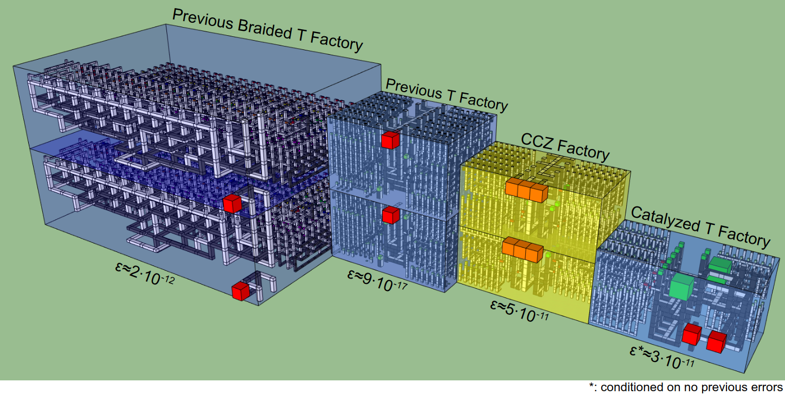

This is the latex source for the paper
"Efficient magic state factories with a catalyzed |CCZ> to 2|T> transformation"
available at https://arxiv.org/abs/1812.01238 .

The easiest way to get this source to build into an actual PDF document is to dump the repo contents into an overleaf.com project.

